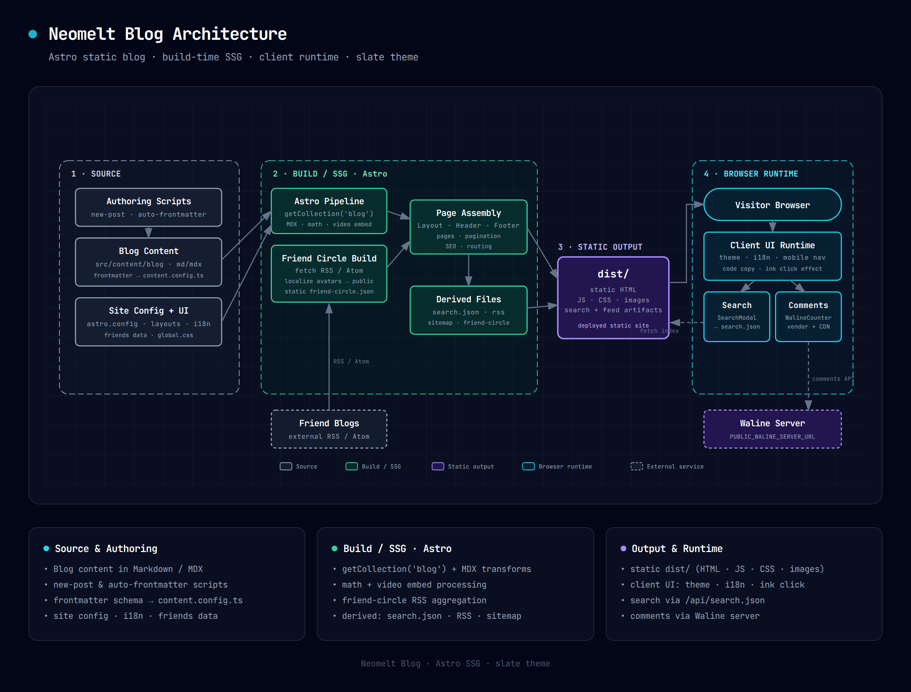

# Neomelt Blog

基于 Astro 的个人博客项目。

## 架构图



图源是 `docs/architecture/neomelt-blog-architecture.html`——一个自包含的深色架构图（内联 SVG、手工排版、坐标固定），按 [Cocoon 架构图 skill](https://github.com/Cocoon-AI/architecture-diagram-generator) 的风格绘制。改完图后重新生成 `.png`：用浏览器打开该 HTML，点右上角 `⋯` → `🖼️ PNG` 导出即可，无需额外工具。

## 目录结构

```text
.
├── docs/
│   └── architecture/        # 架构图：.html 源（自带导出）+ .png
├── public/                  # 直接静态资源（按 URL 原样输出）
│   ├── avatars/             # 构建时下载并本地化的友链头像
│   ├── blog/<文章-slug>/    # 文章正文配图
│   ├── fonts/
│   └── vendor/              # 第三方脚本（如 Waline）
├── scripts/                 # 发布与内容维护脚本
├── src/
│   ├── assets/              # 经 Astro 构建处理的资源（如 cover.svg）
│   ├── components/
│   ├── content/
│   │   └── blog/            # 博客 Markdown/MDX
│   ├── data/                # 站点数据（如 friends 友链）
│   ├── i18n/
│   ├── layouts/
│   ├── pages/
│   │   ├── api/             # search.json 等端点
│   │   ├── posts/           # 列表 / 归档 / 分页 / 详情
│   │   └── terms/           # 隐私、版权、免责声明等
│   ├── styles/
│   ├── utils/
│   ├── consts.ts
│   └── content.config.ts
├── astro.config.mjs
└── package.json
```

## 内容维护约定

- 新文章放在 `src/content/blog/`。
- 文章 frontmatter 默认 `heroImage` 使用 `src/assets/cover.svg`。
- 可以通过 frontmatter 的 `hidden: true` 暂时隐藏文章（不会出现在列表、归档、标签、RSS、搜索，也不会生成公开详情页）。
- 文章插图放在 `public/blog/<文章-slug>/`，在 Markdown 用相对路径引用，如 ``。
- 需要固定公网 URL 的资源放在 `public/`。

## 常用命令

- `npm run dev`：本地开发
- `npm run build`：生产构建
- `npm run preview`：本地预览构建产物
- `npm run test`：运行测试
- `npm run new`：创建新文章模板
- `npm run watch:frontmatter`：自动补齐 frontmatter

## 自动生成文章头（frontmatter）

现在有两种方式：

- `npm run new` / `npm run new:post`：创建新文章并自动写入完整 frontmatter
- `npm run watch:frontmatter`：监听 `src/content/blog/`，给“缺失 frontmatter 的 md/mdx”自动补齐

### 方式 1：新建文章时自动生成

交互式创建（推荐）：

```bash
npm run new
```

命令行参数创建：

```bash
npm run new -- --title "我的新文章" --tags "astro,blog" --category "开发" --series "折腾记录"
```

常用参数：

- `--title` 文章标题（必填）
- `--slug` 文件名（默认由标题自动生成）
- `--desc` 描述
- `--tags` 逗号分隔标签
- `--category` 分类
- `--series` 系列
- `--pinned` 是否置顶（`true/false`）
- `--hidden` 是否隐藏（`true/false`）
- `--hero` 头图路径（默认 `../../assets/cover.svg`）
- `--pubDate` 发布时间（默认当前时间）
- `--dry-run` 只预览，不落盘

### 方式 2：已有文章自动补齐 frontmatter

```bash
npm run watch:frontmatter
```

说明：

- 启动后会先扫描一次 `src/content/blog/`
- 之后监听文件变化，发现没有 frontmatter 的 `.md/.mdx` 会自动补齐
- 已经有 frontmatter 的文件不会被覆盖

## 视频快捷插入

在博客 Markdown 中支持以下写法，最终渲染为响应式 iframe：

```md
@[video](https://www.youtube.com/watch?v=M7lc1UVf-VE)
@[youtube](M7lc1UVf-VE)
@[bilibili](https://www.bilibili.com/video/BV1xx411c7mD)
```

## 致谢

本项目的架构图采用 [Cocoon AI](https://github.com/Cocoon-AI) 开源的 [Architecture Diagram Skill](https://github.com/Cocoon-AI/architecture-diagram-generator) 绘制——其深色主题设计系统与内联 SVG 模板（MIT License，Copyright © 2025 Cocoon AI）为本图的样式与排版提供了基础。在此向原作者表示诚挚的谢意。
