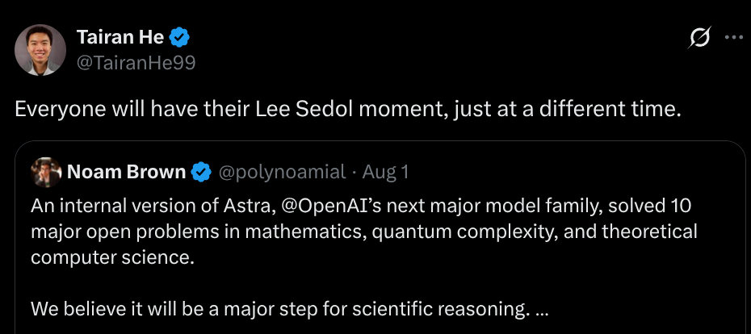

前两天在X上看到Tairan He的一句评论："Everyone will have their Lee Sedol moment, just at a different time."

从我大学拥有自己电脑后第一次接触ai时的gpt 3.5到现如今的 claude mythos5 /fable5 系列，opus5,gpt 5.6，deepseek v4等模型百花齐放的景象，才过去了不到三年的时间，ai已经从曾经那个只是存在于web chat,鲜为人知的东西变成了如今无人不晓的智能助手，在这期间，来了很多人，走了更多的人。

AI的发展改变了人们对他的态度，三年前，ai几乎无法独立并且良好的承担工作，甚至简单的学习辅助，那时候如果有人看到ai写代码时一定要嗤之以鼻的，直到2025年初的时候，vibecoding的概念横空出世，加之claude,openai,gemini等一众模型的发布和cursor这种IDE的发布使得ai coding的的主流风向快速地变成了vibecoding。在2026年的夏天，越来越多的公司开始使用ai native 的开发模式，越来越多的程序员，研究者从恐慌转变为接收这种开发/科研模式。

这让我不禁思考：当有一天，机器人也是这样逐步的发展，等到某一个可以证明机器人可以替代大部分人都工作的时候都那一天：我想会是很具有悲情色彩和机遇的体验。

2016 年，李世石输给 AlphaGo 已经成了 AI 史上最著名的画面之一。

2026 年 8 月，这种感受又被推到了数学上。OpenAI 发布了一份 249 页的材料，称其中十项数学和理论计算机科学结果由内部模型获得，内容包括非 sofic 群的显式构造、对 Connes 刚性猜想的反例等。[公开 PDF](https://cdn.openai.com/pdf/ten-proofs-oai.pdf) 的确包含十篇完整手稿，也明确写着结果来自内部模型。

这意味着模型已经能够生成值得领域专家严肃检查的研究手稿。

围棋有封闭规则、明确胜负和几乎无限的自我对弈。AlphaGo Zero 最惊人的地方，不只是它赢过人，而是它不再从人类棋谱开始，在三天自我对弈后就以 100:0 击败了曾战胜李世石的公开版 AlphaGo。[DeepMind 当年的说明](https://deepmind.google/blog/alphago-zero-starting-from-scratch/) 给出了这个结果。

一种很有解释力的框架是：一个领域越容易得到廉价、稳定、可重复的反馈，机器就越容易形成训练闭环。这不能单独预测所有领域的进展顺序，却能解释一个反直觉的现象：数学研究中的一部分任务，可能早于通马桶被突破；机器人学家的某个“李世石时刻”，也可能早于水管工真正失去工作。

这就是 Moravec 悖论最反讽的地方：在人类看来很高级的抽象推理，往往比我们下意识完成的感知与运动更容易被计算。

但是从某种意义上来讲：李世石是幸运的，他的Lee Sedol moment是确定的，我们很多人甚至都不会意识到这一天的到来，只能在事后才明白早已过去，就像ai之于程序员。

我相信，robotics终将会迎来属于我们的Lee Sedol moment,而且会和ai非常像。对机器人来说，我认为这个时刻至少应该满足几个条件：面对没有为它专门设计的真实环境，在没有遥操作和人工兜底的情况下，连续完成一项有实际价值的任务，并在成功率、速度或者成本上达到甚至超过熟练的人类。

AlphaGo 可以通过自我对弈得到近乎无限的数据，LLM 也拥有互联网规模的文本以及可以大规模并行的训练目标。但机器人没有这么廉价的反馈：每一次动作都要发生在真实或模拟的物理环境中，真机会磨损、会碰撞，仿真又很难完全复现摩擦、柔性和接触。因此机器人真正缺少的，也许是一套能够规模化运行的“动作—结果—修正”闭环。

人类从出生开始就在持续接收视觉、触觉、本体感觉和动作反馈，语言是在这套具身经验上逐渐生长出来的。现在一部分 VLA 走的却是另一条路径：先继承视觉语言模型的语义知识，再用有限的机器人数据把这些知识接到动作上。我不知道这种差异是不是机器人进展缓慢的决定性原因，但它至少说明，语言里的“知道”和身体能够使用的“知道”之间仍然隔着一层 grounding。

我仍然不认为单纯依靠语言模型直接输出动作会是最终方案。未来的机器人智能很可能还需要把视觉、触觉、本体感觉、动作历史、长期记忆和某种后果预测机制放进同一个闭环。它最终是否还会被叫作 LLM 我们无从得知，但真正重要的是系统真正完成这些的能力。

将视角放回到2026年的行业内：vla？world model？rl？或者说其他的什么混合方案，哪一个会是方向呢，或者说是当前的局部最优解呢，我不知道，但是可以肯定的一点是，不管算法框架怎么变，可靠的硬件和高质量的物理交互数据都是绕不过去的约束
至于最终的价值会沉淀在哪一层，现在还不能确定。
