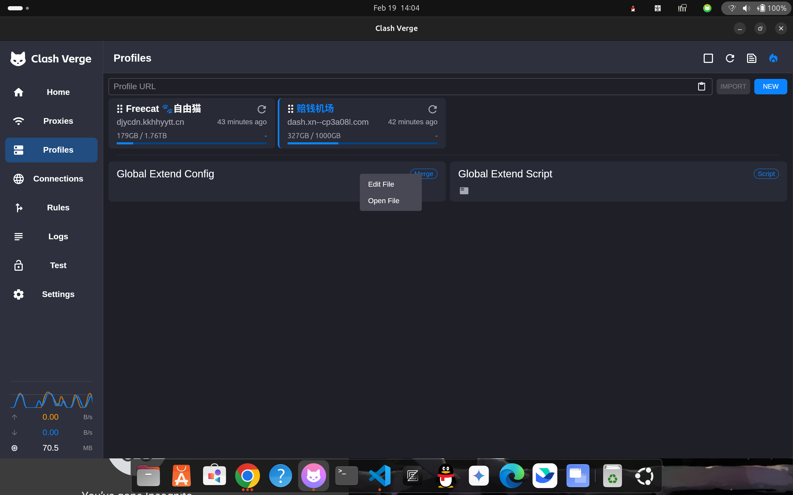
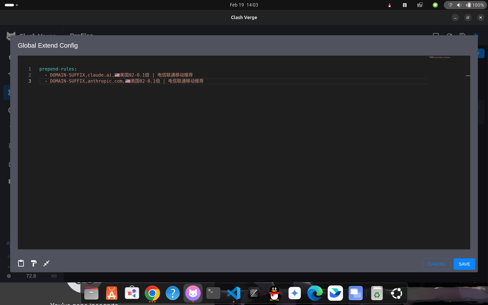

## 引言

众所周知，Claude 对于国内的管控非常严格，比如 IDC IP 连坐、虚拟号秒拒、新号高危等等，之前总是觉得其他好像也能用，但是在尝试了 copilot 、anti-gravity 和 Qoder，但是实际上体验都很一般，copilot 体验最差，完全就像一个未开智的小登，一直给你堆屎山；qoder 次之，虽然还算便宜，但是搭配具体的使用便捷性和方式来说很不习惯，充了一个月 pro 用了三四天就再也没有用过了，最近在用 anti-gravity，免费但是很容易断连，不过模型还是不错的，写写前端和一些简单的后端我觉得是很不错的，而且 plan 模式我是很喜欢的，但是就是很不稳定吧。

昨天晚上看到有群友(大佬)招人，一个要求是会用 Claude,我顿时很感慨，加上我今天早上在知乎看到一篇回答[^1]：Redis之父也宣称 vibecoding 改变了他的生活方式,这篇回答里有句话说的很好：“朋友，我就一个建议。不管你觉得理想的世界应该是啥样，你都没法通过拒绝现实去改变它。死撑着不用 AI，对你的职业生涯一点好处都没有。动动脑子，认真试一下这些新工具。多花几周去沉浸式体验，别试个五分钟就忙着给自己原有的偏见找补。你要想办法让自己，一个人活成一支队伍。如果现在觉得不好用，过几个月再试试。你可能觉得，自己辛辛苦苦学了这么久编程，结果现在机器全代劳了。但你想想，当年你熬夜写代码，看着项目跑通时，你心里那团火到底是因为什么？是因为，创造。现在，如果你能玩转 AI，你能构建出更多，更牛的东西。那种乐趣，一点都没变。” 

看到这我瞬间觉得很感动：对啊，我的目的不就是做有趣的事情吗，而且我曾经也说过“好的工具能够显著的提高开发效率”，这样来看我之前对vibecoding的反感荡然无存，是啊，我们需要的是产品、是结果，而不是这个东西是怎么来的，没有人真正关心你的东西是怎么写出来的，你做出来了你就是牛，这就是你的产品，而且那种创造的感觉一点没有变。

## 前置条件

干净的节点与环境隔离

### 节点选择

别迷信原生 IP，关键看风控值。个人实测使用美国加州圣何塞的节点，通过 whoer.net 测试伪装度达到 90%（DNS 无泄漏）

### 环境无菌室

绝对不要在日常使用的主力浏览器直接注册！

在 Chrome 中新建一个无任何账号登录的独立 Profile（配置），这能确保你的本地 Cookie 和以前访问国内网站的复杂浏览器指纹不会污染新环境。（Edge应该也可以，不过我想很多技术er应该都会喜欢chrome的简约）

将 claude.ai 保存为本地 PWA 应用，彻底隔绝本地 Cookie 和复杂指纹污染。之后访问 claude.ai 也尽量走这个新的 profile，避免被封号。

## 接码

登录最好使用注册时间较长的gmail账号，以谷歌账号的形式登录应该会更加安全。

然后就是需要手机号验证了，这是最大的难点了。
### 接码平台推荐

避开已失效的老平台（如 sms-activate）和各种 GV 虚拟号。实测使用 hero-sms （博主两次就成功了）或 PingMe。

> 核心法则——“归属地一致”： 节点是美国 IP，就必须买美国的实体手机号。

收到后尽量手动键盘输入，不要复制粘贴(虽然我是直接cv的没啥事，但是还是尽量谨慎一点好)

## 给路由加层规则

> (注：本文以经典版 Clash Verge 为例，使用 Rev 版本或其他客户端的用户，核心思路都是通过 Merge 或 Rule Providers 将 claude.ai 和 anthropic.com 的流量固定为同一节点)”

找到自己的代理软件的 profiles 界面，找到下面这个方框

然后右键edit进入代码界面,将自己的节点名称写进去（一个字也不能错）

设置完之后save然后重启内核即可生效，但是一定要记得将代理模式切为rule，不然如果走的是global的话一旦切换了节点，你Claude的ip也会跳，会引发很大的封号危机。

## 注意事项

- 尽量用新的、干净的profile来登录 claude.ai，防止被复杂的cookies环境干扰导致封号。

- 尽量不要随意切换ip登录 claude.ai，最少也要隔6小时。

[^1]: [Redis 之父称「手写代码不再必要」，你如何看待 AI 对编程的影响？](https://www.zhihu.com/question/1995213825918641040/answer/1999195986283749895)
