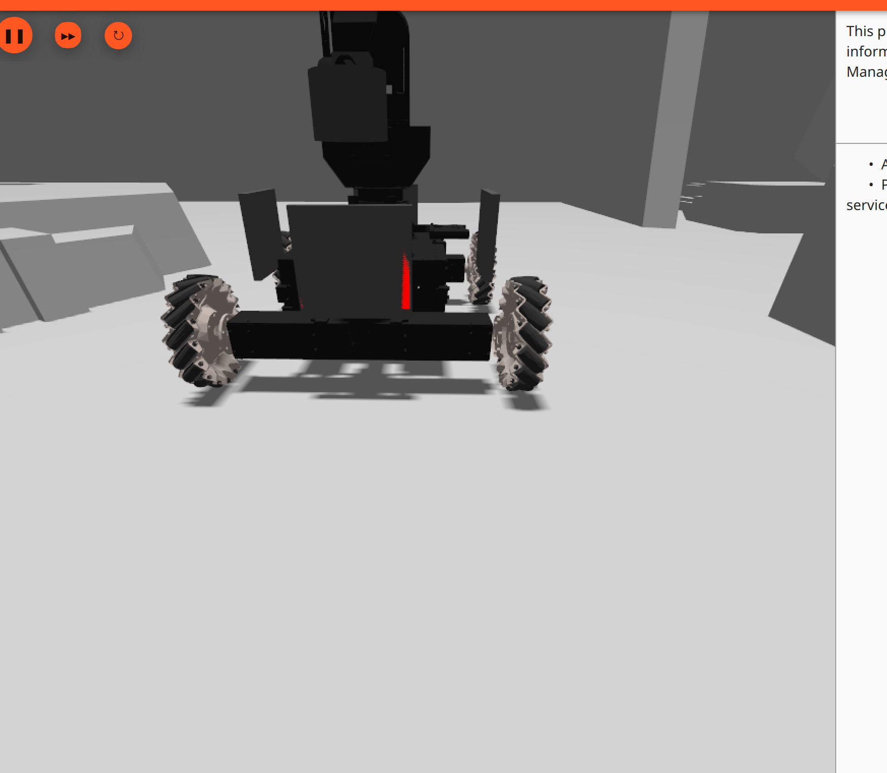
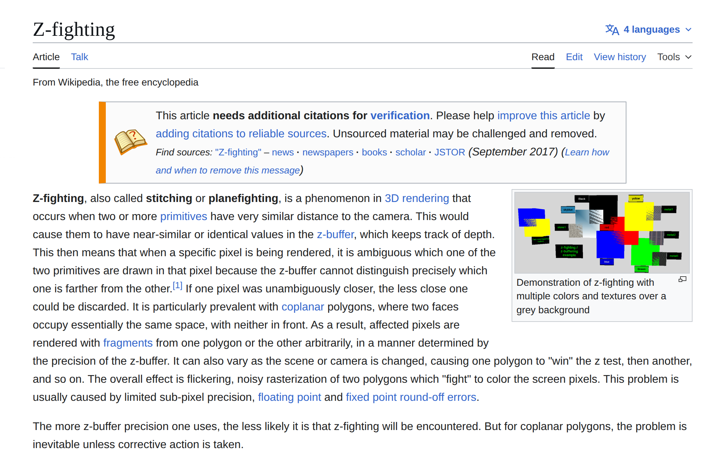
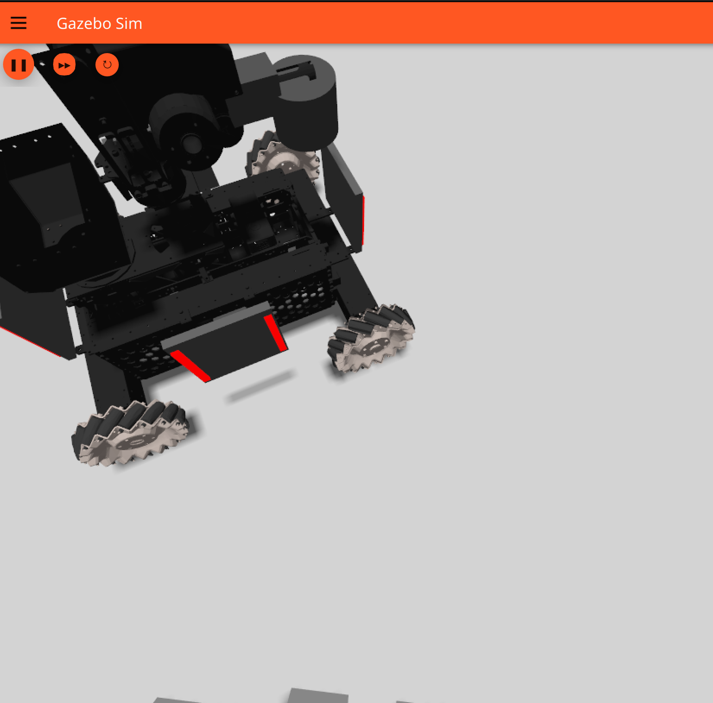
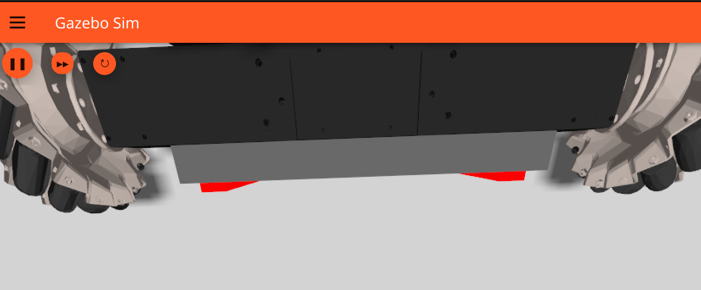

今天在 Gazebo 里调一个仿真模型时，遇到了一个显示问题：车体上的灯条只有在差不多正对着看的时候才显示得比较完整，一旦视角稍微偏一点，边缘就像缺了一块，转动镜头的时候还会忽隐忽现，大概像这样：

可以看到当我们转动视角之后部分灯条会消失，一开始我怀疑的是材质或者光照。因为这个灯条本身用了 `emissive`，看起来像是“自发光”的部件，所以第一反应会觉得是不是 Gazebo / Ogre2 对这种材质的表现不太稳定。但后面仔细看现象之后，发现问题其实不在光照，而在几何本身。

## 现象

这个问题最明显的表现有几个：

- 只有接近正视角时灯条显示还算完整
- 一旦转动视角，灯条表面开始闪烁
- 有时边缘会变细，像是被削掉了一层
- 有时会出现局部破碎或者忽隐忽现

查了一下资料，也顺手问了 GPT，才知道这种“跟着视角变化一起抖”的问题，其实很像经典的 `z-fighting`。

## 排查过程

回头看模型结构之后，问题很快就对上了。

前装甲板在 `model.sdf` 第 84 行附近，厚度写的是 `0.012`，所以它的前表面在局部坐标里相当于 `x = +0.006`。

前灯条在 `model.sdf` 第 93 行附近，中心偏移是 `x = 0.003`，自身厚度是 `0.006`，所以它的前表面也是 `x = +0.006`。

这就意味着，灯条的外表面和装甲板的外表面正好压在同一个位置上。更准确地说，灯条其实有一部分嵌进了装甲板里，只把最外面那一层面和外壳表面重合了。

后、左、右几个灯条也基本是同样的写法，所以会一起中招。

## 原因

这个问题本质上不是“谁的世界坐标更靠前”那么简单。

GPU 在渲染的时候，会对每个像素做深度比较。屏幕上的每个像素都有一个 depth buffer，用来记录当前离相机最近的片元。

问题在于这个深度值不是无限精确的。常见深度缓冲精度只有 24 bit 左右，而且经过透视投影之后，深度分布本身还是非线性的。

如果两个面非常接近，甚至干脆共面，那么它们投影到同一个像素时，深度值就会接近到深度缓冲分不清谁前谁后。结果就是：

- 有时这个面通过深度测试
- 有时另一个面通过深度测试
- 相机一转，投影关系和像素覆盖变化之后，显示结果也跟着跳

这就是 `z-fighting`。

这里顺手放一张 wiki 对 `z-fighting` 的解释图：

一句话概括就是：两个几乎贴在一起的面，在深度缓冲里抢前后顺序。

### 为什么一转视角更明显

这个现象特别容易让人误判成“材质闪了”或者“光照不稳定”，但其实它和视角变化强相关，是因为深度比较发生在投影之后的屏幕空间里。

相机一转，同一个三角形会落到不同像素上，每个像素的深度量化结果也会变，所以原本勉强还能显示的两个面，就开始交替抢占可见性，表现出来就是闪烁、缺块和边缘抖动。

如果物体离得更远、场景尺度更大，或者相机的 `far clip / near clip` 比例很夸张，这种问题通常还会更明显。

## Gazebo 仿真的局限性

这里顺手记一下一个容易混淆的点。

灯条用了 `emissive`，它更接近“这个材质自己看起来是亮的”，并不等价于“它真的会像灯一样照亮周围环境”。

所以：

- “没有真实泛光、照不到环境”这件事，确实和 Gazebo / Ogre2 的材质表现有关
- “转视角时灯条破碎、闪动、变细”这件事，核心是几何面重合导致的 `z-fighting`

这两个现象可能同时出现，但不是同一个问题。

## 解决办法

这个问题最稳的修法其实很简单，就是不要让两个面重合，给它们留一个很小的间距。

比如这几个灯条的位置，可以把原本贴得太近的偏移量稍微往外挪一点：

- 前灯条从 `0.003` 改到 `0.007`
- 后灯条从 `-0.003` 改到 `-0.007`
- 左右两侧同理

这样灯条会从装甲板表面稍微“抬出来”一点点。这个量级通常 1 到 2 mm 就够了，肉眼几乎看不出来，但深度缓冲已经能稳定区分两个面了。

另一类办法是用 `depth bias` 或者 `polygon offset`，有些引擎在做 decal、标记层时会这样处理。不过在普通 SDF 模型里，直接把几何错开一点通常更稳，也更直观。

修好效果

虽然真实装甲板和灯条的上表面本来就可能非常接近，但在真实世界里，这点差异通常不会像仿真里这样被放大。这大概也是仿真和现实之间一个很典型的小区别。

## 经验总结

这次问题本身不算复杂，但确实很值得记一下。

以后在搭仿真的时候如果看到下面这种现象：

- 模型表面某一层东西贴着底面
- 转视角时开始闪
- 边缘抖动、缺块、忽隐忽现

那就可以优先往这几个方向查：

1. 先查是不是共面或者几乎共面
2. 再查是不是相机 near / far clip 导致深度精度不够
3. 最后再去怀疑材质、光照或者驱动

像灯条、铭牌、装饰片、UI 面板、地面标线这种“贴表面”的结构，只要两层面重合，就迟早会遇到 `z-fighting`。

这算是一个很典型的图形学老问题。不是 Gazebo 独有，也不是老引擎才会有。只要还是光栅化渲染、还是有限深度精度，这个坑就一直都在。
