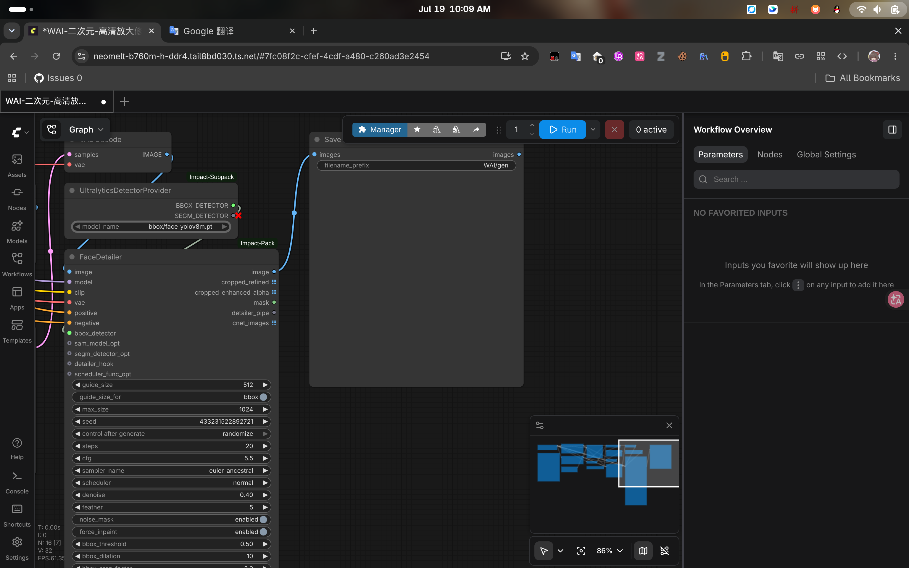
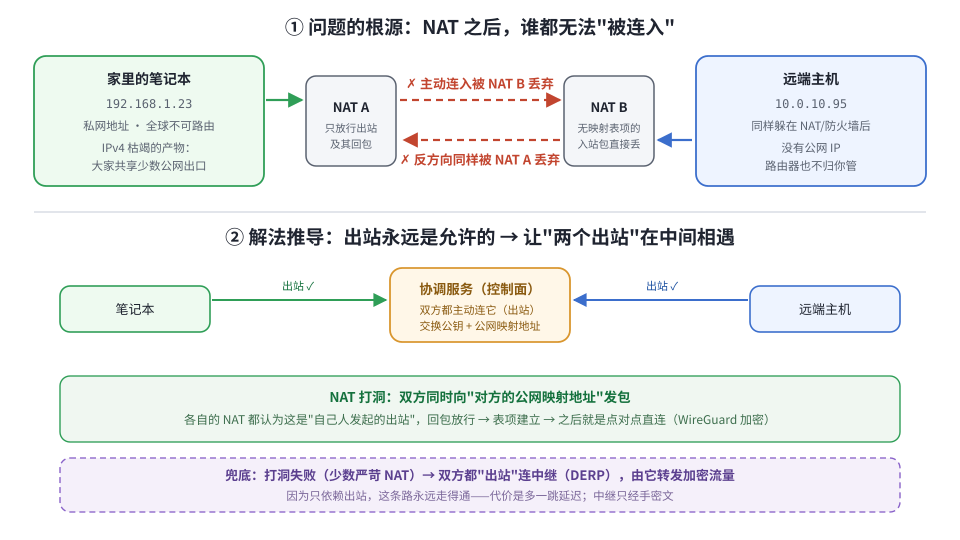
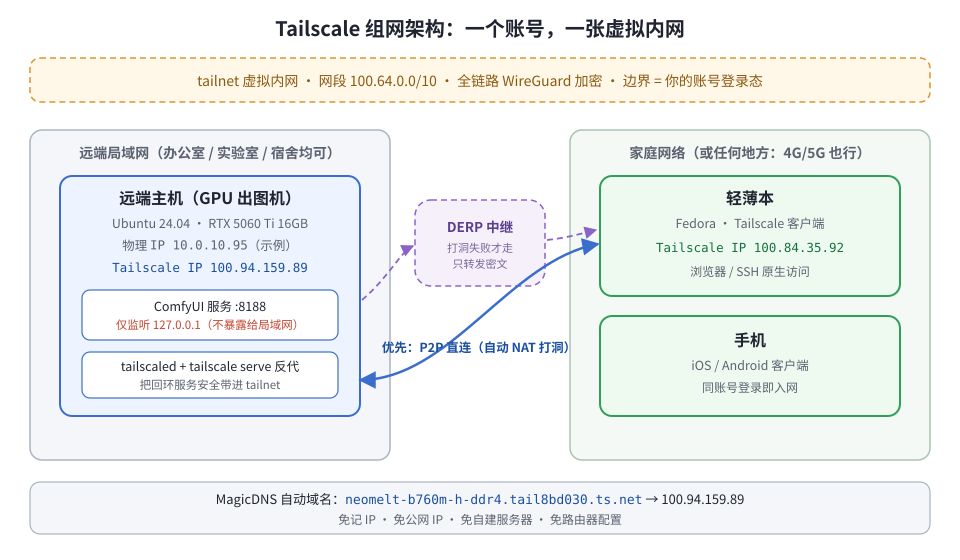
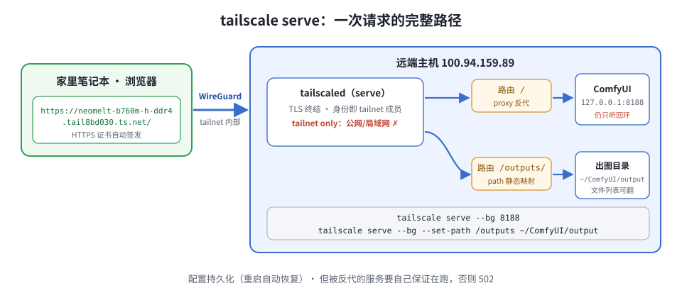
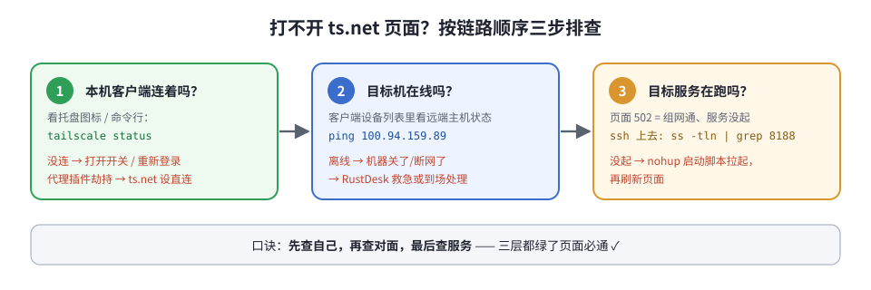

手上有张显卡一直闲着，想拿来跑生图，苦于没办法远程调用，问了 Claude 有没有解法，答案是 Tailscale。下面先从网络本身的约束讲起，捋清楚为什么只能这么干，再落到具体命令。

## 先看效果

远端有一台带 RTX 5060 Ti 的 Linux 主机，上面跑着 ComfyUI 出图服务，只监听 `127.0.0.1:8188`。我人在家里，轻薄本浏览器打开一个域名，就是完整的原生 Web 界面。这不是远程桌面串流，是真在浏览器里操作，没有串流那种卡顿：



全程不需要公网 IP、不需要自建服务器、不需要动路由器，而且这个服务**从头到尾没有暴露给公网，甚至没有暴露给它所在局域网里的任何人**。

## 两台机器互访，到底需要什么

先不急着谈工具。两台机器要能互访，需要的东西就三样：

1. 得有个地址，能被路由到对方；
2. 路径上每一跳（路由器、防火墙、NAT）都愿意帮你把包转过去；
3. 公网不可信，所以还得能确认对方是谁，并且把流量加密。

麻烦在于，前两条在今天的互联网上**默认不成立**。IPv4 地址早在 2011 年就分配殆尽，绝大多数设备拿到的是 RFC 1918 私网地址（`192.168.x` / `10.x`），躲在 NAT 后共享少数公网出口；家宽还常常再叠一层运营商级 NAT（CGNAT，Carrier-Grade NAT），这时候连你家路由器的 WAN 口拿到的都不是公网地址，端口映射根本没得做。而 NAT 说白了就是个单向阀：

> 出站连接及其回包放行；没有映射表项的入站包，一律丢弃。

于是家里的笔记本和远端主机各自躲在 NAT 后面，谁都没法被对方连进来。这不是哪里坏了，也不是你配置没弄对，就是 IPv4 不够用、大家挤一个出口的结果：



## 只剩三条路

入站被堵死之后，能走的路其实就剩三条：

| 路线 | 思路 | 代价 |
|---|---|---|
| A. 制造公网可达点 | 买 VPS 做中转（frp 等）；或路由器端口映射 | 服务器钱和维护；映射需要你没有的路由器权限，家宽还常无公网 IPv4 |
| B. 放弃网络层，搬画面 | 远控软件（RustDesk / 向日葵） | 得到的是"屏幕"不是"网络"：画质延迟受限，无法 curl / SSH / 调 API |
| C. 钻 NAT 的空子 | 出站反正是允许的，那就让两边各自出站，在中间碰头 | 几乎没有，见下 |

路线 C 展开就是 NAT 穿越（NAT traversal），也就是俗称的打洞。两边先各自出站连一个会合点，把"我的公网映射地址和端口"跟"我的公钥"交换一下，然后同时朝对方的映射地址发包。两边的 NAT 都以为这是自家发起的会话，各自建了表项，回包就放行了，洞打通之后就是纯点对点直连。

这里"向会合点问出自己的公网映射地址和端口"，就是 STUN 在做的事（Session Traversal Utilities for NAT，现行标准 RFC 8489；早期的 RFC 3489 里 STUN 是另一个全称，现在已经废弃了，别搜错）。而"直连、打洞、中继几条路一起试，哪条通用哪条"是 ICE（RFC 8445）的思路。打洞走 UDP 不走 TCP，一是 WireGuard 本身就跑在 UDP 上，二是 TCP 打洞还要额外对付连接状态机，复杂度高出一截。

上面说的"少数严苛 NAT"得讲准点，它直接决定你会不会被迫走中继。NAT 建映射有两种行为：只按源地址端口分配、对谁都复用同一个映射的，叫端点无关映射（endpoint-independent mapping, EIM），这种能打洞；对每个不同目标都新开一个映射的，叫端点相关映射（EDM），也就是常说的对称型 NAT（symmetric NAT）——你从会合点问到的那个端口，拿去连对方时根本不是同一个，洞自然打不通。这套 NAT 行为的分类出自 RFC 4787，后面"怎么知道自己走的是直连还是中继"一节里有实测判断方法。

打不通就退回"两边都出站连一个中继，由它转发"，无非多一跳；因为只依赖出站，这条路总是走得通。

到这里路线 C 还差两块。前面第 3 条要的信任交给 WireGuard，密钥对就是身份，全程加密，跑在内核态，性能损耗基本可以不管。另外还需要一个"介绍人"服务，管公钥分发、地址簿和打洞撮合，注意它只负责介绍，数据流量不经它的手。

把这一套连打洞带中继带密钥管理全自动化到"装上就通"，就是 Tailscale。它没造什么新技术，就是认了 NAT 这个现实，然后把绕过去的路给修好了。

Tailscale 常被归到"内网穿透"里，但它跟 frp / ngrok 那一类不是一个东西：它是覆盖网络（overlay network）形态的 mesh VPN。两者确实都要解决 NAT 穿越，可目标是相反的——内网穿透是把某个服务暴露给公网，安全边界落在"地址没人知道"；mesh VPN 是把你自己的设备拉进同一个虚拟局域网，安全边界落在密钥。上面那张表里的路线 A 才是典型的内网穿透，本文走的是路线 C。后面 serve 和 funnel 的区别，说的还是这条线。

## 名词对照

上面推导出来的每个角色，Tailscale 里都有个对应的叫法：

| 推导中的角色 | Tailscale 名词 | 说明 |
|---|---|---|
| "我的设备们"这个信任集合 | tailnet | 边界 = 登录了你账号的设备（本质是一组 WireGuard 公钥） |
| 虚拟地址 | `100.x.y.z` | 取自 CGNAT 保留段 100.64.0.0/10（RFC 6598），不与家用网段冲突 |
| 会合点 / 介绍人 | 控制面 / coordination server（login.tailscale.com） | 分发公钥与地址簿、撮合打洞；不经手流量 |
| 打洞失败的兜底中继 | DERP | Designated Encrypted Relay for Packets，全球部署，只转发密文 |
| 给地址起名 | MagicDNS | `设备名.tailnet名.ts.net` 自动解析 |
| 把本机服务开门给 tailnet | tailscale serve | 反代 + 自动 HTTPS，仅网内可见 |
| serve 的公网版 | tailscale funnel | 会暴露到互联网——本文用不到，不确定就永远别开 |

组网后的全景是这样的：



个人免费额度 100 台设备，这个场景绰绰有余。

## 实操：远端主机安装

安装按官方文档手动来，一共四步，不用 `curl | sh` 那种黑箱。国内网络实测 `pkgs.tailscale.com` 和控制面均直连可达，无需代理：

```bash
# 1. 加官方 apt 源（noble = Ubuntu 24.04，其他版本换代号）
curl -fsSL https://pkgs.tailscale.com/stable/ubuntu/noble.noarmor.gpg \
  -o /usr/share/keyrings/tailscale-archive-keyring.gpg
curl -fsSL https://pkgs.tailscale.com/stable/ubuntu/noble.tailscale-keyring.list \
  -o /etc/apt/sources.list.d/tailscale.list

# 2. 装的是数据面守护进程 tailscaled（WireGuard 隧道就归它管）
apt-get update && apt-get install -y tailscale

# 3. 入网 = 把本机公钥注册进你的 tailnet：
#    会打印 https://login.tailscale.com/a/xxxx 链接，任意设备浏览器打开登录即可
tailscale up

# 4. 授权日常用户免 sudo 管理（serve 等命令不再要 root）
tailscale set --operator=你的用户名
```

建议把四步存成脚本 `sudo bash tailscale-setup.sh` 一次跑完。跑完 `tailscale ip -4` 能看到本机的 `100.x` 身份。

**前置检查一项**：被远程访问的机器不能自动休眠。GNOME 下看
`gsettings get org.gnome.settings-daemon.plugins.power sleep-inactive-ac-timeout`，
为 `0` 即永不休眠（type 字段哪怕是 `suspend`，timeout 为 0 就不会生效）。

## 客户端（笔记本 / 手机）

装官方客户端（tailscale.com/download，手机在应用商店搜），**登录同一个账号**就行。前面名词对照里说过，tailnet 就是"登录了你账号的所有设备"，所以不存在单独的"组网"步骤——不用填对方 IP，也不用交换什么配置，客户端登录完，这台设备就已经在网里了。

任一设备上验证：

```bash
$ tailscale status
100.94.159.89  neomelt-b760m-h-ddr4  linux  -
100.84.35.92   fedora                linux  -
```

两台都在，组网完成。这时候 SSH 就已经能用了——远端 sshd 本来就在监听，只是过去你"够不着"它，现在可达性有了：

```bash
ssh neomelt@100.94.159.89
```

## 实操：把 ComfyUI 开给 tailnet

先说清一件事：一个服务监听哪个地址，等于它在决定信任谁。

监听 `0.0.0.0` 是信任整个局域网，而 ComfyUI 压根没有登录认证，等于把一扇没锁的门开给同网段所有人。监听 `127.0.0.1` 只信任本机，安全，但家里就用不上了。我想要的是第三种，只信任我自己那几台设备，而这正好就是 tailnet。

`tailscale serve` 就是把边界从"本机"外扩到"tailnet"的那扇门。远端主机上一条命令：

```bash
tailscale serve --bg 8188
```

有两点要注意。第一次跑会提示 tailnet 还没启用 Serve，命令打印一个 `login.tailscale.com/f/serve?...` 链接，然后就开始轮询等着，看着像卡死了，其实是等你去浏览器点一下启用，这是个一次性开关，点完命令自己就继续了。之后网内任何设备打开 `https://设备名.tailnet名.ts.net` 就能到。这里用 HTTPS 是因为浏览器对明文页面有各种功能限制，而 ts.net 的证书是自动签的，你什么都不用配，首次访问慢几秒就是在签证书。

顺手再挂一个静态目录，翻出图产物用（与反代共存于同一域名）：

```bash
tailscale serve --bg --set-path /outputs /home/neomelt/ComfyUI/output
```

```text
$ tailscale serve status
https://neomelt-b760m-h-ddr4.tail8bd030.ts.net (tailnet only)
|-- /         proxy http://127.0.0.1:8188
|-- /outputs/ path  /home/neomelt/ComfyUI/output
```

一次请求的完整路径是这样。注意 ComfyUI 从头到尾只监听回环，门开在 tailscaled 上，而 tailscaled 只认自己 tailnet 里的成员：



## 日常使用

```bash
# 远端主机上起服务（>> 追加日志；zsh 开了 noclobber 的话 > 第二次会翻车）
nohup ~/ComfyUI/start.sh >> ~/ComfyUI/comfyui.log 2>&1 &

# 停服务（按端口杀，不误伤；pkill 按名字匹配有相对路径的坑）
fuser -k 8188/tcp

# 人在家里远程起停：先 SSH 上去，再执行上面两条
ssh neomelt@100.94.159.89
```

浏览器收藏两个地址就够了：主界面 `https://xxx.ts.net`，出图目录 `https://xxx.ts.net/outputs/WAI/`。

## 怎么知道自己走的是直连还是中继

前面推导说打洞成功走 P2P、打不通退 DERP，那自己这条链路实际走的哪种？不用猜，两条命令就能看出来。

`tailscale netcheck` 报告本机的网络条件，下面是这台远端主机的实测输出（公网地址已抹掉）：

```text
* UDP: true
* IPv4: yes, x.x.x.x:52812
* MappingVariesByDestIP: false
* PortMapping:
* Nearest DERP: Singapore
* DERP latency:
    - sin: 41.3ms  (Singapore)
    - hkg: 76.3ms  (Hong Kong)
    - blr: 78.9ms  (Bengaluru)
    - tok: 118.4ms (Tokyo)
    ...
```

要看的就三处。`UDP: true` 说明 UDP 出站没被封，这是打洞的前提。`MappingVariesByDestIP` 正是前面 EIM / EDM 那个概念的实测判定——`false` 表示映射不随目标变化，属于能打洞的那类；这里要是 `true`，那就是对称型 NAT，这台机器大概率只能走中继。`Nearest DERP` 和那张延迟表是万一走中继时的兜底路径。

具体某条连接实际走哪，看 `tailscale status` 的末列。前面组网验证时那两行末列是 `-`，意思是当时没有活跃流量；连接活跃时这一列会变成 `active; direct <地址:端口>` 或 `active; relay <节点>`，走中继时还会带上 DERP 节点的城市代号。单独探一条连接则用 `tailscale ping 设备名`。

## 运维速查

```bash
tailscale status                  # 所有节点在线状态（末列看 direct / relay）
tailscale ip -4                   # 本机 100.x 地址
tailscale netcheck                # 本机网络条件：UDP、NAT 类型、DERP 延迟
tailscale serve status            # 当前反代路由表
tailscale serve --https=443 off   # 关掉全部反代
tailscale down / up               # 本机断开 / 恢复入网
```

## 避坑与排障

下面都是我实际踩过的坑：

- serve 第一次运行时看起来像卡住了，其实是在等你去管理台点启用，不是 bug（前面 ComfyUI 一节说过）。
- serve 的配置是持久的，机器重启后反代路由会自动恢复；但被反代的服务本身（ComfyUI）不归它管，得自己拉起来，不然页面 502。
- 浏览器的代理插件可能会劫持 `.ts.net` 域名，走了代理反而解析失败，把这个域名加进直连规则就好。
- DERP 中继的延迟：`netcheck` 实测这台机器最近的节点是新加坡 41.3ms、香港 76.3ms、东京 118.4ms，节点列表里没有中国大陆。但要注意这是**单边到中继的 RTT**，真走中继时两端各绕一趟，端到端只会比这个数更大。我没实测过完整走中继的链路，具体多少不打包票。打洞成功走 P2P 的体验很好。

页面打不开的时候，按顺序查三层就行：先确认自己这台设备入网了，再确认对面那台机器在线，最后确认它上面的服务还活着。哪一层出的问题很快就能定位出来：



## 最后说说安全

tailnet 说到底就是"你账号名下的一堆 WireGuard 公钥"，一台设备能不能进来由密钥决定，跟它在哪个网络里没有关系，其实这就是"零信任"这个词的意思。流量全程加密，就算走 DERP 中继，中继手里拿到的也只是密文——私钥从不离开本机，中继没有解密的可能。

不过"由密钥决定"这句还差一层：公钥的分发是控制面在管的，所以你隐含信任了 Tailscale 的控制面不会往你的 tailnet 里偷偷塞节点。官方文档自己把这个威胁写得很直白——"If Tailscale were malicious, and stealthily inserted new nodes into your network, then Tailscale could send or receive traffic to your existing nodes in plaintext."。要堵这个口子就得开 tailnet lock：开启之后，新节点必须被你指定的签名节点签过名，其他节点才认它，信任就从 Tailscale 的基础设施移到你自己手上了。个人自用开不开另说，但这层信任在哪得心里有数。

还有件事我一开始没意识到：你的 `ts.net` 域名并不是秘密。serve 的 HTTPS 证书是 Tailscale 替你从 Let's Encrypt 签的，而公开 CA 签出去的证书都必须写进 Certificate Transparency 日志，这是浏览器强制的要求，本意是让 CA 没法偷偷乱签证书。代价就是证书里的域名也跟着公开了，所以别人在 crt.sh 上搜你的 tailnet 名字，就能把你所有开过 serve 的机器名列出来。

这件事本身不影响 serve 的安全性，公网上那个名字后面根本没有监听端口，拦住外人的是密钥，不是域名难猜。但它有个实际后果——"反正没人知道我的域名"这层心理防线根本不存在。所以再强调一遍 serve 和 funnel 的区别：serve 只开给 tailnet 内部，funnel 是直接暴露到公网。哪天你手滑给这台机器开了 funnel，域名早就在公开日志里躺着了，被扫到只是时间问题，而 ComfyUI 连登录都没有。这种服务只能用 serve。

Tailscale 还有一些这篇没用到的功能：ACL（控制哪台设备能访问哪台的哪个端口）、Tailscale SSH、exit node（把全部流量从某台设备出去）、tailnet sharing（把单台设备分享给别人的账号），有需要可以再研究。

## 附：环境与版本

- 服务端：Ubuntu 24.04 (noble)，tailscale 1.98.9，2026-07-18 配置
- 客户端：Fedora 笔记本 + 手机
- 被反代服务：ComfyUI 0.28.0（监听 127.0.0.1:8188）
- 网络环境：远端局域网（无公网 IP、无路由器权限）↔ 家庭宽带，实测组网与访问正常
- 文中所有命令都在上述环境里实际跑过，`netcheck` 那段是服务端的实测输出
- 只有 `tailscale status` 的 `direct` / `relay` 那列我没实测到，依据的是官方 CLI 文档
