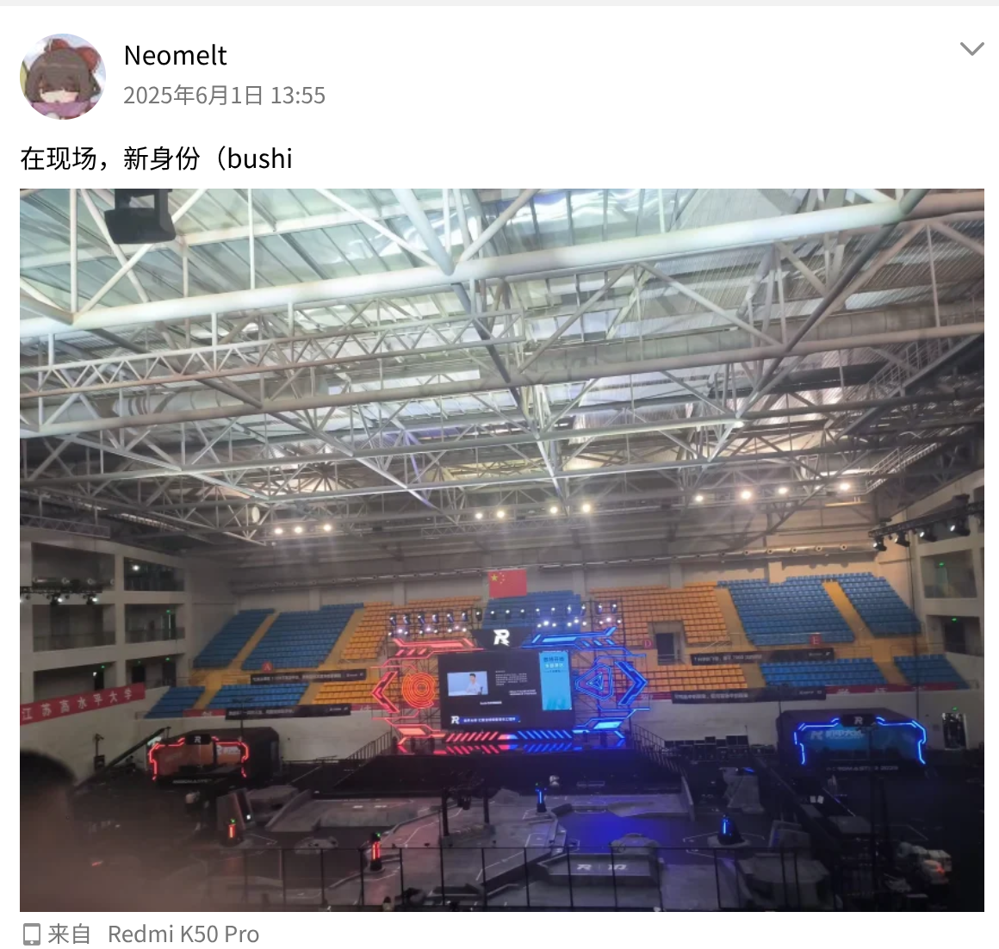

今年是真的作为观众了，现在回想起来25赛季结束的时候发了个空间：

26赛季前半程我基本都是跟着的，在陪他们烧烤拍完联盟赛完整形态后我就算是彻底的退休了，听他们说后期都没想着能进对抗赛，据说拍完对抗赛的完整形态很多人从心态上就已经崩盘了，甚至都开始写赛季总结了😂，我常常在想：为什么上一年能预见到，再进步一点就能抵达那梦想之地，可经历了一整个赛季的沉浮，却还是只差那么一点？我想了很久，始终想不通。

技术，管理，资金，人力，无论是从公司还是一个学生机器人组织来看，这几部分都是毋庸置疑的组成基石。如果真的以一种严苛的视角审视这支队伍，基本上每一个角度都说不上优秀，但是对于一群脱产且从来没有接受过体系化的技术、管理的培养的愣头青来说，似乎也无法苛责太多。在这样一个倡导学术至上、基础教育崩塌的大学环境里，注定无法找到很多能够完全沉下心来做工程的人，这也就可以解释为什么每一年都是一些真的想做好、能沉下心做的人做了绝大多数的工作。

从管理的角度来说其实也不应该去苛责。一个好的管理比一个优秀的技术人员更加难遇到，所以说技术做得好的人不一定是一个好的管理者，这也就解释了为什么看似管得很可以、但是总感觉哪里不太对劲的问题。队里现在形成的思维就是觉得做技术做得好的人应该在打完自己的赛季之后去做管理，但是其实从公司的角度去看，管理的技术水平可以不是很好，或者说从来没做过技术。可学生组织和公司是不一样的，公司那套没办法完全照搬到学生组织上来——首先两者的人才库是完全不同的，对于一群刚刚经历过12年填鸭教育的脱产群体来说，这还是太难了。

所以至此我得出了一个悲观的结论：没有真正管理过中小型组织的人指导、光靠学生，是很难将一个队伍真正带到一个健康的运作状态的。

所以，我现在的心态又转变到了个人发展优先的半边——在不完全影响队伍进度的情况下专注于个人技术的精进和职业生涯的发展。我很喜欢一句话：每一个rmer心里都有一座金灿灿的奖杯。rmer应该在意的不一定只是总冠军的奖杯，还可以是那颗总冠军的心，怀着这种心态去想其实比赛输赢也好，各种杂事也好，沟通矛盾也好，似乎都是可以调和的，但是这些终究还是太理想了……